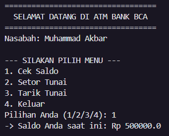
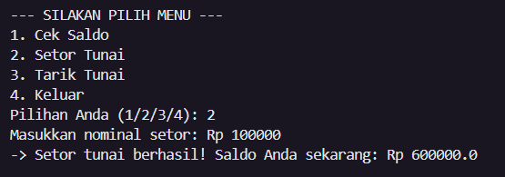
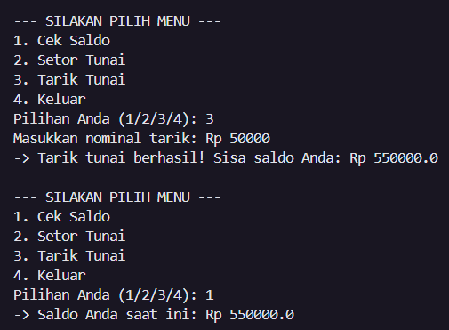

# 🏦 Tugas Eksplorasi PBO - Simulasi Bank & Mesin ATM Interaktif

Repository ini berisi tugas Latihan/Eksplorasi materi **Array of Objects** dan **Komposisi (Has-A Relationship)** menggunakan bahasa pemrograman Java.

Program ini mensimulasikan sistem perbankan terstruktur yang terdiri dari Entitas Bank, Nasabah, dan Rekening, yang diakhiri dengan simulasi interaktif Mesin ATM.

## ⚙️ Fitur Program

- **Manajemen Nasabah:** Mendaftarkan nasabah baru ke dalam Bank (dilengkapi batas limit _array_ maksimal 5 nasabah).
- **Manajemen Rekening:** Membuka dan mengelola hingga 5 rekening berbeda untuk setiap nasabah.
- **Validasi Transaksi:** Proteksi penarikan dana (transaksi akan ditolak jika saldo tidak mencukupi).
- **ATM Interaktif:** Menu terminal (_Command Line Interface_) untuk melakukan Cek Saldo, Setor Tunai, dan Tarik Tunai secara langsung.

## 🏗️ Struktur Class (Arsitektur)

1. **`Account.java`**: Fondasi terbawah. Menyimpan data saldo (`balance`) dan memproses logika matematika untuk transaksi `deposit` (setor) dan `withdraw` (tarik) menggunakan tipe _return boolean_.
2. **`Customer.java`**: Merepresentasikan nasabah. Menyimpan identitas nama dan memiliki sebuah Array penampung objek `Account` (Nasabah bisa memiliki banyak rekening).
3. **`Bank.java`**: Entitas tertinggi. Menyimpan daftar nasabah di dalam sebuah Array penampung objek `Customer`.
4. **`Main.java`**: Ruang mesin utama. Berisi inisialisasi data (membuat Bank, mendaftarkan Nasabah, membuat Rekening) dan logika _looping_ untuk Menu ATM Interaktif.

## 📌 Library yang Digunakan

- `java.util.Scanner` : Digunakan secara khusus pada class `Main.java` untuk menangkap input keyboard dari _user_ sehingga menu ATM dapat berjalan secara interaktif.

## 📸 Screenshot Hasil Program (Output)

1. **Screenshot Menu Utama & Cek Saldo**

   

2. **Screenshot Setor Tunai & Tarik Tunai**
   
   

   


```

```
